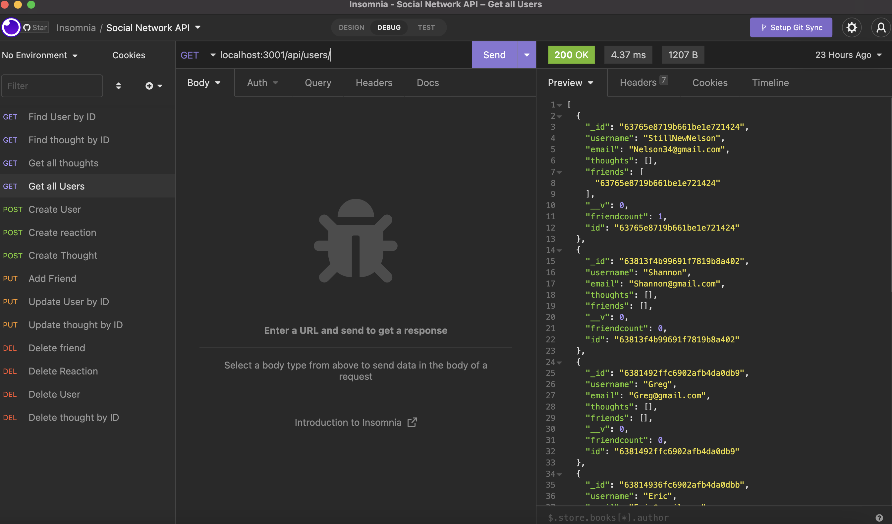

# Social-Network-Api

This application performs all the functionality a social media site may have such as: 
    1. Creating, updating, and deleting users
    2. Creating, updating, and deleting thoughts
    3. Creating, updating and deleting reactions to those thoughts.

## Technologies
This API utilizes NoSql (MongoDB), and express.

### Screenshot
Below you can see an example of the functionality.

#### Demo
[You can watch the demo here](https://watch.screencastify.com/v/inblYiy1K3U4bywP5rcz)

#### Testing/Usage
This app requires MongoDB. To seed the database enter npm run seed in the terminal. To start the server enter npm start. You will then be able to test the routes and app functionality using Insomnia.